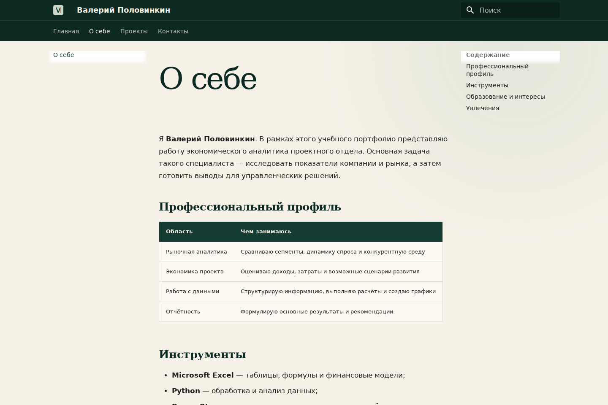
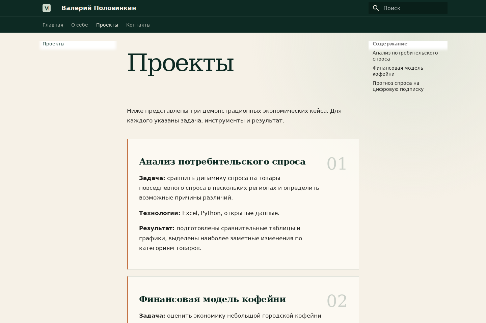
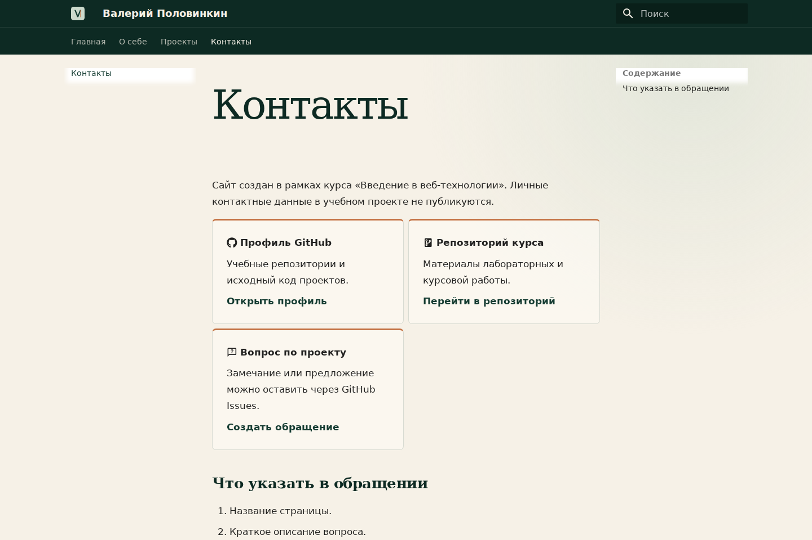
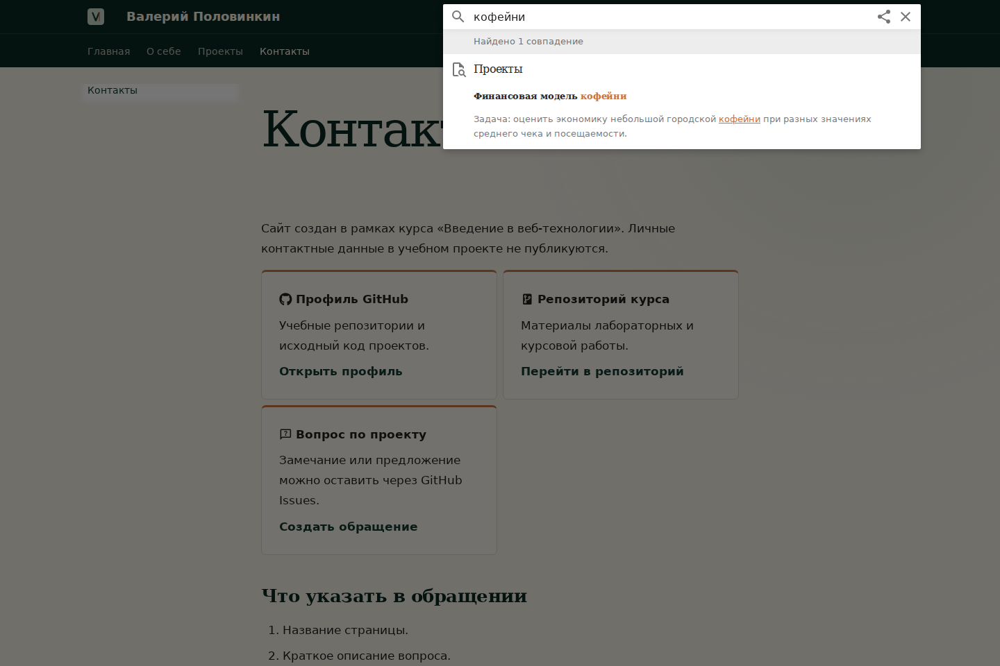
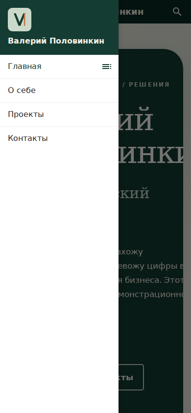

University: [ITMO University](https://itmo.ru/ru/)  
Faculty: [FICT](https://fict.itmo.ru/)  
Course: [Введение в веб-технологии](https://ex-itmo-ict-faculty.github.io/introduction-in-web-tech/education/coursework2025-2026/coursework/)  
Year: 2026/2027  
Group: U4225  
Author: Половинкин Валерий Валерьевич  
Date of create: 13.09.2026  
Date of finished: 13.09.2026

# Курсовая работа

## Создание персонального сайта с использованием MkDocs

**Автор:** Половинкин Валерий Валерьевич.  
**Сайт:** [Открыть опубликованное портфолио](https://made-in-tyo.github.io/devops-lab-polovinkin/).  
**Репозиторий:** [Made-in-TYO/devops-lab-polovinkin](https://github.com/Made-in-TYO/devops-lab-polovinkin).

## Введение

В работе создан персональный учебный сайт на MkDocs с темой Material. Концепция
сайта — демонстрационное портфолио экономического аналитика. Оно показывает,
как можно оформить профессиональную информацию, проекты и контакты средствами
Markdown, не публикуя реальные достижения и личные контактные данные автора.

Профессиональная роль, кейсы и результаты на страницах сайта являются
вымышленными и используются только для выполнения учебного задания. Имя и
фотография автора размещены с его согласия.

**Цель работы:** освоить создание, настройку, проверку и публикацию статического
сайта с помощью MkDocs, Markdown и GitHub Pages.

**Задачи:**

1. Подготовить структуру проекта и зависимости.
2. Настроить MkDocs Material, навигацию и поиск.
3. Создать четыре обязательные страницы из задания.
4. Использовать основные элементы Markdown и локальные изображения.
5. Добавить индивидуальное адаптивное оформление.
6. Выполнить строгую сборку и проверить ссылки и ресурсы.
7. Настроить автоматическую публикацию на GitHub Pages.

## 1. Используемые технологии

**Markdown** используется для текста страниц: заголовков, списков, ссылок,
изображений, цитат и таблиц.

**MkDocs 1.6.1** преобразует файлы Markdown и конфигурацию `mkdocs.yml` в
статические HTML-страницы. Команда `serve` запускает локальный просмотр, а
`build` создаёт готовую сборку в папке `site/`.

**Material for MkDocs 9.7.7** предоставляет навигацию, поиск, адаптивный
интерфейс, карточки и набор иконок.

**CSS** используется для индивидуальной изумрудно-кремовой палитры, композиции
главного экрана, оформления портрета, таблицы, карточек и мобильной адаптации.

**GitHub Actions и GitHub Pages** автоматически собирают и публикуют сайт после
изменений курсовой работы в ветке `main`.

## 2. Подготовка проекта

Работа выполнена в Windows 11 с Python 3.13.0. Зависимости проекта закреплены в
`requirements.txt`:

```text
mkdocs==1.6.1
mkdocs-material==9.7.7
```

Для локального запуска в Windows Git Bash используются команды:

```bash
py -m venv .venv
.venv/Scripts/python.exe -m pip install -r requirements.txt
.venv/Scripts/python.exe -m mkdocs serve
```

Виртуальное окружение `.venv/` и собранная папка `site/` внесены в корневой
`.gitignore` и не попадают в репозиторий.

Итоговая структура курсовой:

```text
coursework/
├── README.md
├── mkdocs.yml
├── requirements.txt
├── docs/
│   ├── index.md
│   ├── about.md
│   ├── projects.md
│   ├── contacts.md
│   ├── images/
│   │   ├── logo.svg
│   │   └── portrait.png
│   └── stylesheets/extra.css
└── report/
    ├── coursework.md
    ├── verification.txt
    └── screenshots/
```

Файл автоматической публикации находится в корне репозитория:
`.github/workflows/coursework-pages.yml`.

## 3. Конфигурация и навигация

В `mkdocs.yml` заданы название сайта, описание, автор и фактический адрес
GitHub Pages. Используется тема Material с русским интерфейсом и системными
шрифтами, поэтому сайт не зависит от загрузки Google Fonts.

Навигация содержит ровно четыре обязательных раздела:

```yaml
nav:
  - Главная: index.md
  - О себе: about.md
  - Проекты: projects.md
  - Контакты: contacts.md
```

Активированы вкладки, секции, кнопка возврата к началу, нижняя навигация,
подсветка результатов поиска и возможность поделиться поисковым запросом.
Плагин `search` настроен для русского и английского языков.

## 4. Содержание страниц

| Страница | Содержание | Элементы задания |
| --- | --- | --- |
| Главная | Представление концепции, направления и рабочий подход | Заголовки, маркированный и нумерованный списки, ссылки, портрет, цитата, кнопки |
| О себе | Учебная самопрезентация, инструменты, образование, интересы и увлечения | Таблица, списки, выделение текста, информационный блок |
| Проекты | Три вымышленных экономических кейса | Карточки, названия, задачи, технологии, результаты и ссылка на исходники |
| Контакты | Допустимые способы связи без личных данных | GitHub, репозиторий, Issues, иконки и нумерованный список |

На главной странице использованы обычные элементы Markdown и HTML-контейнеры.
Расширение `md_in_html` позволяет обрабатывать Markdown внутри контейнеров,
которые формируют первый экран и карточки.

Для защиты приватности в тексте прямо указано, что профессиональная роль,
проекты, результаты и увлечения являются учебной демонстрацией. Реальные
достижения, телефон, email и личные социальные сети не публикуются.

## 5. Изображения, поиск и оформление

Портрет хранится в `docs/images/portrait.png`. Локальный SVG-логотип с буквой
«V» используется в шапке и как favicon. Все изображения входят в репозиторий,
поэтому внешний фотохостинг не требуется.

При сборке MkDocs создаёт `search/search_index.json`. Проверочный запрос
«кофейни» находит карточку проекта «Финансовая модель кофейни».

Основные цвета оформления:

| Назначение | Цвет |
| --- | --- |
| Основной тёмно-зелёный | `#153c32` |
| Тёмный фон шапки | `#0d2a23` |
| Кремовый фон | `#f6f1e7` |
| Медный акцент | `#c47345` |
| Светло-зелёный акцент | `#cbd9cb` |

В `extra.css` настроены первый экран, рамка и тень портрета, кнопки, карточки,
таблица, цитата, футер и медиазапрос для узких экранов. Иконка стрелки в кнопке
выровнена относительно текста отдельным правилом.

## 6. Тестирование и сборка

Статическая сборка выполнена в строгом режиме:

```bash
python -m mkdocs build --strict
```

| Проверка | Результат |
| --- | --- |
| `mkdocs build --strict` | Успешно, код завершения 0 |
| Содержательные страницы | 4 страницы и служебная страница 404 созданы |
| Локальные ссылки, ресурсы и якоря | Проверено 127 ссылок, ошибок не найдено |
| HTTP-проверка страниц | `/`, `/about/`, `/projects/`, `/contacts/` вернули 200 |
| Статические ресурсы | Поиск, портрет, логотип и CSS вернули 200 |
| Поисковый индекс | 15 записей; запрос «кофейн» находит 1 результат |
| Внешние ссылки | 6 используемых адресов вернули HTTP 200 |
| Проверка в браузере | Заголовки четырёх страниц и поиск отображаются корректно |
| Мобильный вид 390 × 844 | Горизонтальной прокрутки нет, меню открывается |

Подробный текстовый протокол сохранён в
[verification.txt](verification.txt).

Material выводит информационный блок о будущей версии MkDocs 2.0. Это не ошибка
проекта: установлена и закреплена версия MkDocs 1.6.1, а строгая сборка
завершается успешно.

## 7. Публикация на GitHub Pages

Для репозитория подготовлен workflow
`.github/workflows/coursework-pages.yml`. После изменения курсовой в `main` он:

1. получает исходники репозитория;
2. устанавливает Python и зависимости из `requirements.txt`;
3. запускает строгую сборку MkDocs;
4. загружает папку `coursework/site` как Pages-артефакт;
5. публикует артефакт в окружение `github-pages`.

Для публикации в Settings → Pages источником выбирается **GitHub Actions**.
После успешного выполнения workflow сайт доступен по HTTPS:

<https://made-in-tyo.github.io/devops-lab-polovinkin/>

При дальнейших изменениях исходников отдельная ручная публикация не требуется.

## 8. Скриншоты готового сайта

Скриншоты сделаны после итоговой строгой сборки и показывают видимую область
сайта без панели браузера, вкладок и посторонних окон.

### Рисунок 1. Главная страница


### Рисунок 2. Страница «О себе»



### Рисунок 3. Страница «Проекты»



### Рисунок 4. Страница «Контакты»



### Рисунок 5. Поиск по запросу «кофейни»



### Рисунок 6. Мобильная навигация



## Заключение

Создан и опубликован персональный учебный сайт на MkDocs Material. Реализованы
четыре обязательные страницы, навигация, русскоязычный поиск, локальные
изображения, логотип, футер и индивидуальное адаптивное оформление. Markdown
использован для всех требуемых элементов: заголовков, списков, ссылок,
изображения, цитаты и таблицы.

Строгая сборка, локальные ссылки, ресурсы, поиск и HTTP-доступность проверены.
GitHub Actions автоматически публикует готовую версию на GitHub Pages, поэтому
преподаватель может открыть сайт по обычной HTTPS-ссылке без локального запуска.

## Источники

1. [Методические указания к курсовой работе](https://ex-itmo-ict-faculty.github.io/introduction-in-web-tech/education/coursework2025-2026/coursework/).
2. [Документация MkDocs](https://www.mkdocs.org/).
3. [Material for MkDocs](https://squidfunk.github.io/mkdocs-material/).
4. [Markdown Guide](https://www.markdownguide.org/).
5. [Документация GitHub Pages](https://docs.github.com/pages/).

Дата обращения: 13.09.2026.
