University: [ITMO University](https://itmo.ru/ru/)
Faculty: [FICT](https://fict.itmo.ru)
Course: [Введение в веб технологии]
Year: 2026/2027
Group: U4225
Author: Половинкин Валерий Валерьевич
Lab: Lab1
Date of create: 11.09.2026
Date of finished: —

---

# Лабораторная работа №1. Основы работы с Docker

## Цель работы

Научиться работать с Docker: устанавливать Docker, использовать готовые образы,
запускать контейнеры и управлять ими, а также работать с томами для хранения
данных независимо от жизненного цикла контейнера.

## 1. Установка Docker и базовые команды

Установлен Docker Desktop для Windows. При первом запуске приложение сообщило,
что в системе отсутствует подсистема Windows для Linux, поэтому она была
установлена отдельно командой `wsl --install` в PowerShell с правами
администратора, после чего компьютер был перезагружен.

Проверена установленная версия:

```bash
docker --version
```

Вывод: `Docker version 29.7.2, build a7dcaa6`.

Для проверки работоспособности запущен тестовый контейнер:

```bash
docker run hello-world
```

Образ отсутствовал локально, поэтому Docker сначала загрузил его из Docker Hub
(строка `Unable to find image 'hello-world:latest' locally`), затем создал из
него контейнер и запустил. Получено сообщение `Hello from Docker!`,
подтверждающее корректную работу.

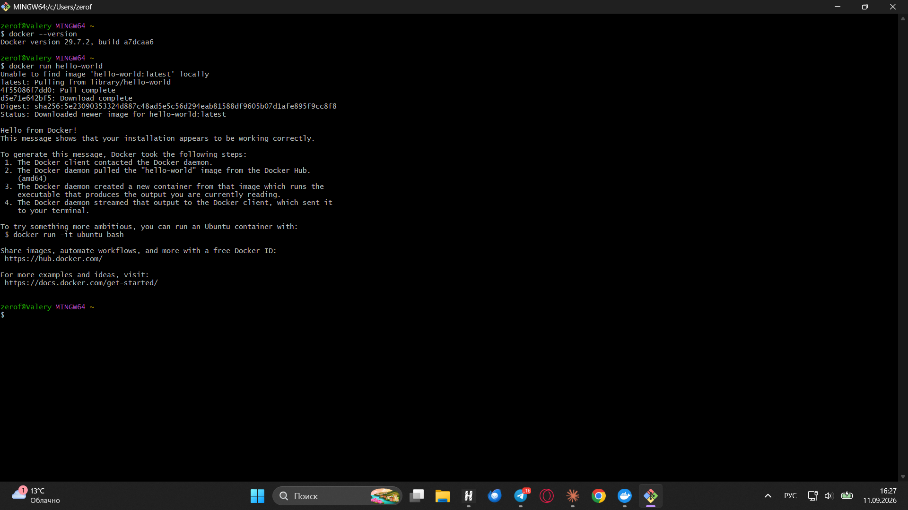

Далее изучены базовые команды просмотра образов и контейнеров:

```bash
docker images
docker ps
docker ps -a
```

Команда `docker images` показала единственный локальный образ `hello-world`.
Команда `docker ps` вывела пустой список, а `docker ps -a` — контейнер
`eloquent_mendel` со статусом `Exited (0)`.

Разница между двумя последними командами существенна: `docker ps` показывает
только работающие контейнеры, тогда как `docker ps -a` — все, включая
завершённые. Завершённый контейнер не исчезает автоматически, он остаётся в
системе и занимает место, поэтому его требуется удалять явно.

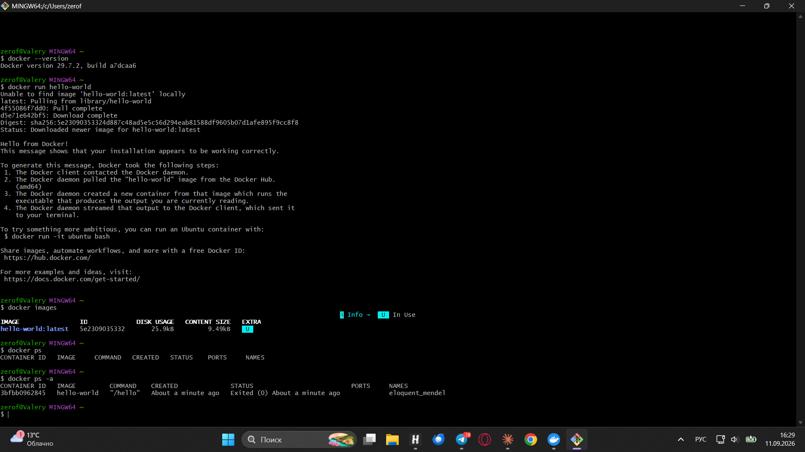

## 2. Работа с готовыми образами

Загружен официальный образ Ubuntu:

```bash
docker pull ubuntu:latest
```

Затем запущен интерактивный контейнер на его основе:

```bash
docker run -it ubuntu bash
```

Флаг `-i` оставляет открытым поток ввода, флаг `-t` выделяет псевдотерминал;
вместе они дают интерактивную консоль внутри контейнера. После запуска
приглашение командной строки сменилось на `root@b7f772aa0c62:/#`, что означает
работу внутри контейнера от имени пользователя root.

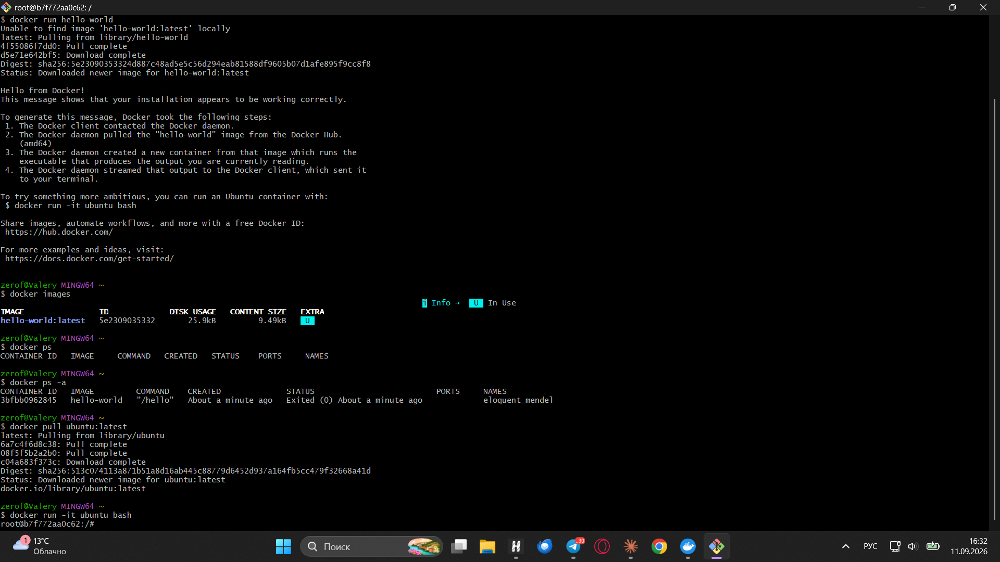

Внутри контейнера установлен пакет `curl`:

```bash
apt update && apt install -y curl
```

Установка сопровождалась предупреждениями `debconf: unable to initialize
frontend: Dialog`. Они не являются ошибками: установщик пытается вывести
диалоговое окно с вопросами, но в контейнере отсутствует графическое окружение,
поэтому он переключается на текстовый режим.

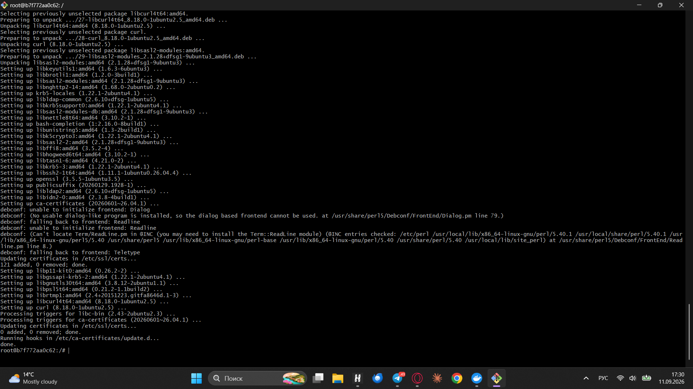

Проверена работоспособность установленного пакета:

```bash
curl --version
```

Вывод: `curl 8.18.0 (x86_64-pc-linux-gnu)`.

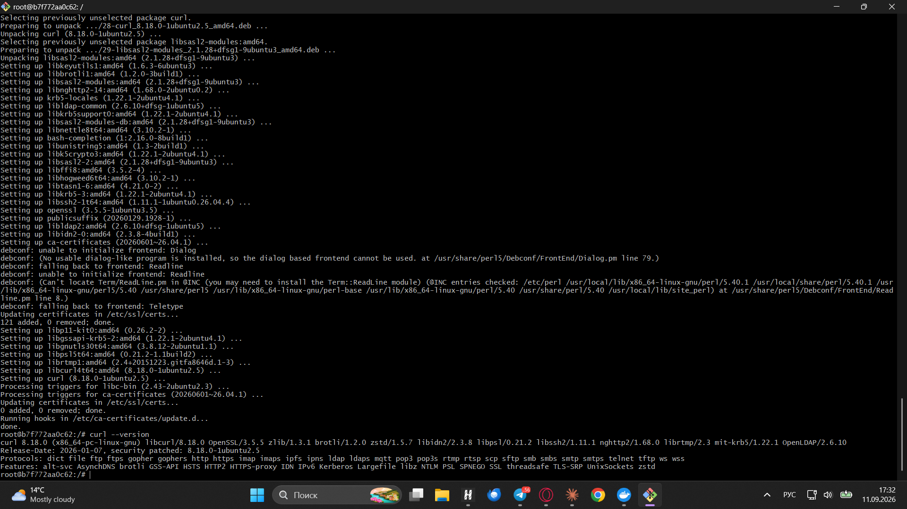

Выход из контейнера выполнен командой `exit`; контейнер при этом
останавливается.

Важное наблюдение: установленный пакет существует только внутри созданного
контейнера. Исходный образ `ubuntu:latest` остаётся неизменным, и при запуске
нового контейнера из того же образа `curl` в нём отсутствует. Именно из этого
свойства вытекает необходимость в томах, рассмотренных в разделе 5.

## 3. Запуск веб-сервера nginx

Запущен контейнер с веб-сервером nginx:

```bash
docker run -d -p 8080:80 --name web-server nginx:alpine
```

Назначение флагов:

- `-d` — запуск в фоновом режиме, терминал сразу освобождается;
- `-p 8080:80` — проброс порта: обращение к порту 8080 хостовой машины
  перенаправляется на порт 80 внутри контейнера, который слушает nginx;
- `--name web-server` — собственное имя контейнера вместо автоматически
  сгенерированного.

При запуске Брандмауэр Windows запросил разрешение на сетевой доступ для Docker
Desktop Backend; разрешение было выдано, без него проброс порта не работает.

Состояние контейнера проверено командой `docker ps`: контейнер `web-server`
находился в статусе `Up`, в столбце `PORTS` отображалась связка
`0.0.0.0:8080->80/tcp`.

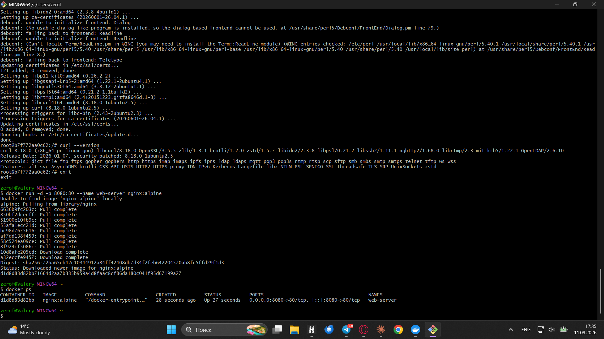

В браузере открыт адрес `http://localhost:8080` — отобразилась стандартная
приветственная страница nginx, что подтверждает работу веб-сервера и
корректность проброса порта.

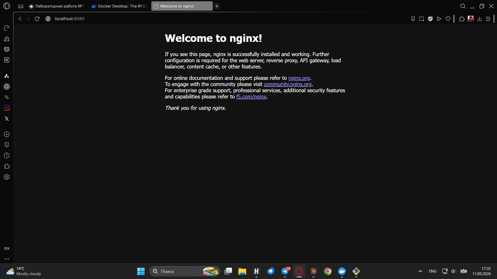

Просмотрены логи контейнера:

```bash
docker logs web-server
```

В логах присутствует запись о запросе из браузера:

```
172.17.0.1 - - [11/Sep/2026:14:35:39 +0000] "GET / HTTP/1.1" 200 896 ...
```

Код ответа `200` означает успешную обработку запроса, `896` — объём переданных
данных в байтах. Адрес `172.17.0.1` — это адрес хостовой машины во внутренней
сети Docker, каким его видит контейнер.

Ниже в логах присутствует запись об ошибке `open()
"/usr/share/nginx/html/favicon.ico" failed` с кодом `404`. Она не является
следствием неверной настройки: браузер автоматически запрашивает значок сайта,
а в базовом образе nginx такой файл отсутствует.

Выполнено подключение к работающему контейнеру:

```bash
docker exec -it web-server sh
```

В отличие от `docker run`, команда `docker exec` не создаёт новый контейнер, а
запускает дополнительный процесс внутри уже работающего, не прерывая его
основную работу. Использована оболочка `sh`, а не `bash`, поскольку образ
`nginx:alpine` собран на минималистичном дистрибутиве Alpine Linux, в котором
`bash` не установлен.

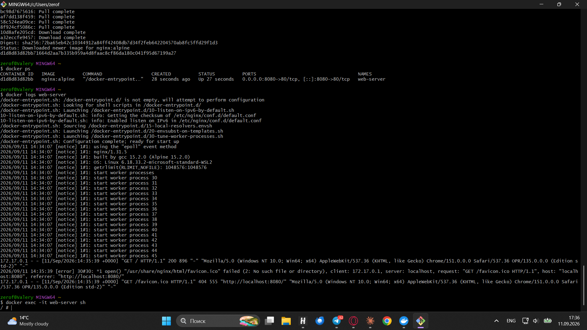

## 4. Управление контейнерами

Выполнена последовательность команд управления состоянием контейнера:

```bash
docker stop web-server
docker start web-server
docker ps
docker stop web-server
docker rm web-server
docker ps -a
```

После повторного запуска в выводе `docker ps` столбец `CREATED` показывал
`4 minutes ago`, тогда как `STATUS` — `Up 7 seconds`. Это подтверждает, что
команда `docker start` не создаёт контейнер заново, а возобновляет работу
существующего.

Удалить работающий контейнер нельзя, поэтому перед `docker rm` контейнер был
остановлен повторно. После удаления контейнер `web-server` исчез и из вывода
`docker ps -a`.

Затем удалён сам образ:

```bash
docker rmi nginx:alpine
docker images
```

Команда вывела две строки: `Untagged: nginx:alpine` — снятие имени с образа, и
`Deleted: sha256:...` — удаление его слоёв. В списке локальных образов
`nginx:alpine` больше не отображается.

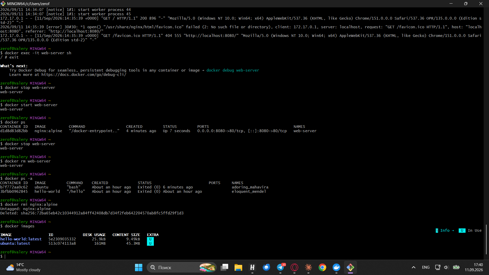

## 5. Работа с томами

Создан именованный том и проверено его наличие:

```bash
docker volume create my-volume
docker volume ls
```

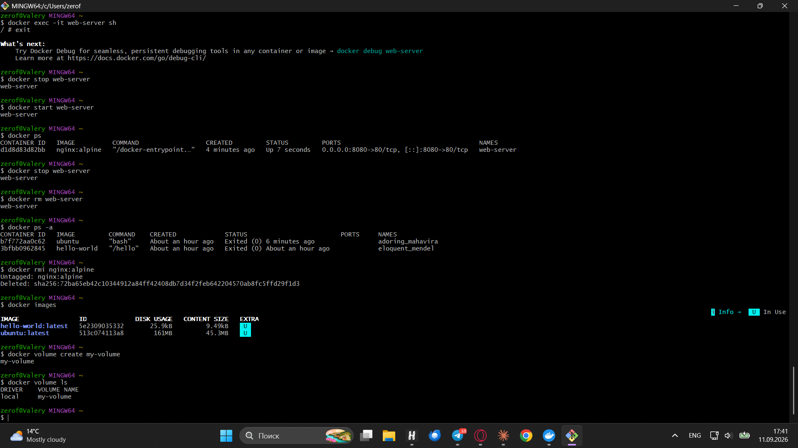

Запущен контейнер с подключённым томом:

```bash
docker run -it --name volume-test -d -v my-volume:/data ubuntu bash
```

Флаг `-v my-volume:/data` подключает том `my-volume` внутрь контейнера как
каталог `/data`. Сочетание `-it` с `-d` необходимо потому, что контейнер живёт
ровно столько, сколько работает его основной процесс: запущенный в фоне `bash`
без открытого потока ввода завершился бы немедленно.

Внутри контейнера создан файл:

```bash
docker exec -it volume-test bash
echo "Hello from volume" > /data/test.txt
cat /data/test.txt
```

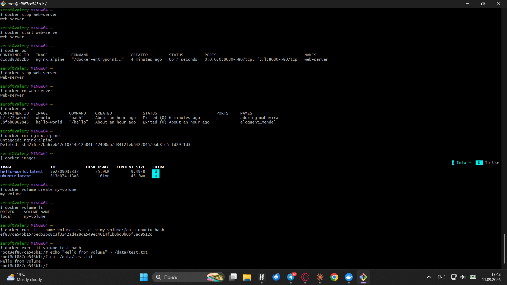

Далее контейнер был остановлен и полностью удалён, после чего создан новый
контейнер с подключением того же тома:

```bash
docker stop volume-test
docker rm volume-test
docker run -it --name volume-test-2 -d -v my-volume:/data ubuntu bash
docker exec -it volume-test-2 bash
cat /data/test.txt
```

Содержимое файла было успешно прочитано: `Hello from volume`. Идентификаторы
контейнеров при этом различаются — `ef887ce545b1` у первого и `e4e80a86e554` у
второго, то есть файл читается из принципиально другого контейнера, тогда как
контейнер, в котором он был создан, физически удалён.

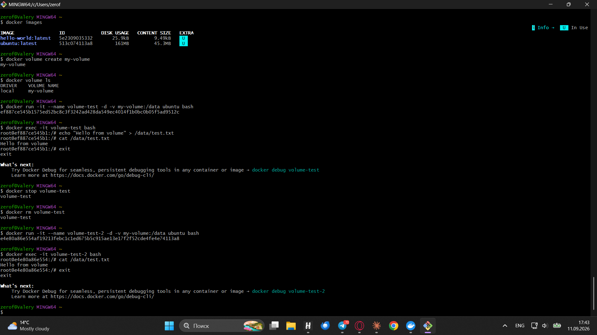

Это подтверждает основное свойство томов: данные в них хранятся отдельно от
контейнеров и не удаляются вместе с ними. На этом свойстве построена работа баз
данных и любых других сервисов с сохраняемым состоянием — приложение можно
перезапускать, обновлять и пересоздавать, не теряя накопленные данные.

## Выводы

В ходе лабораторной работы установлен и настроен Docker Desktop совместно с
подсистемой WSL 2, изучены базовые команды работы с образами и контейнерами.

Практически освоены следующие операции: загрузка готовых образов из Docker Hub,
запуск контейнеров в интерактивном и фоновом режимах, установка пакетов внутри
контейнера, проброс сетевых портов, просмотр логов, подключение к работающему
контейнеру, управление состоянием контейнеров и удаление образов.

Отдельно изучена работа с томами. Экспериментально подтверждено, что данные,
записанные в подключённый том, сохраняются после удаления контейнера и остаются
доступны другому контейнеру, подключившему тот же том. Тем самым разделены два
разных по смыслу объекта: контейнер как одноразовая среда выполнения и том как
постоянное хранилище данных.

Дополнительно выявлена практическая особенность работы в текущем сетевом
окружении: при включённом VPN обращение к репозиториям пакетов Ubuntu
(`archive.ubuntu.com`) происходило со скоростью порядка нескольких килобайт в
секунду, из-за чего установка пакетов внутри контейнера завершалась ошибкой
`Failed to fetch`. После отключения VPN та же операция выполнилась за несколько
секунд. При этом загрузка образов из Docker Hub оставалась быстрой в обоих
случаях, что указывает на проблему маршрутизации именно до зеркал Ubuntu, а не
на общую нехватку пропускной способности.
