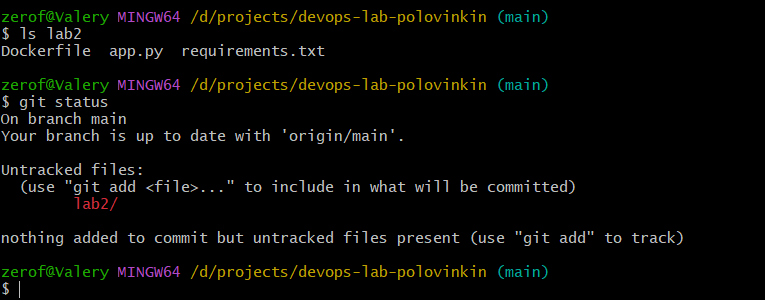
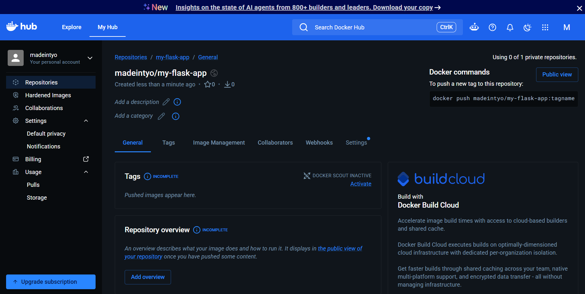
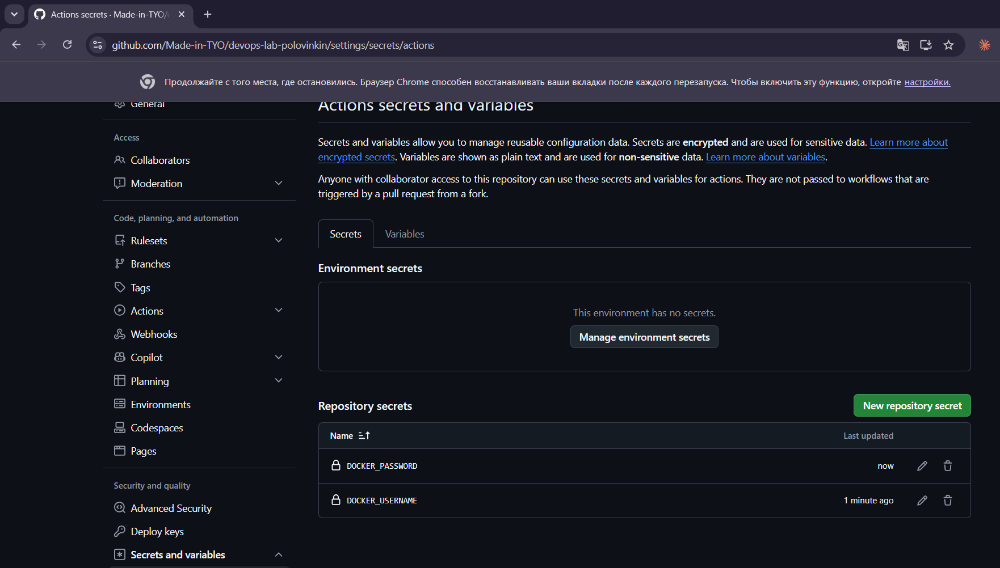
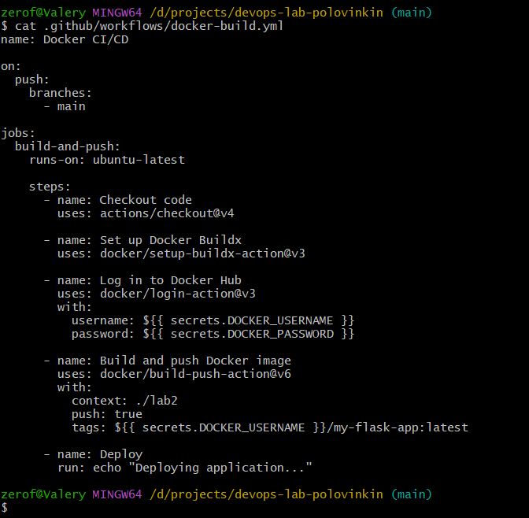
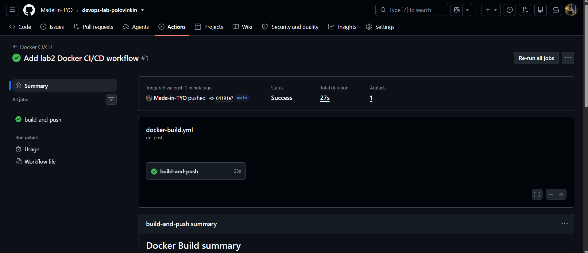
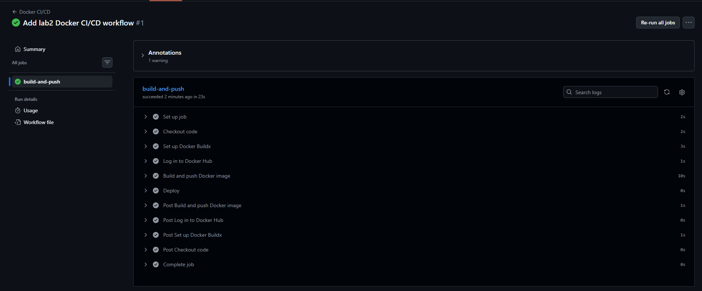
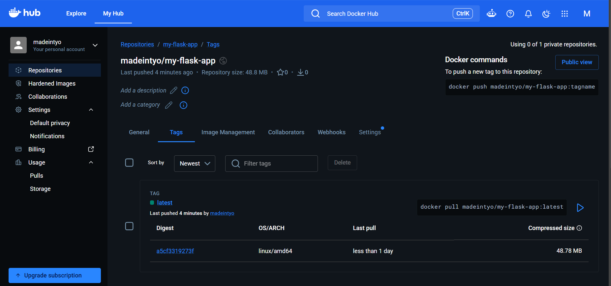

# Лабораторная работа №2

## CI/CD для Docker приложения

**Университет:** Университет ИТМО  
**Автор:** Половинкин Валерий  
**Репозиторий GitHub:** `Made-in-TYO/devops-lab-polovinkin`  
**Docker Hub:** `madeintyo/my-flask-app`

## Цель работы

Настроить CI/CD-пайплайн с использованием GitHub Actions для автоматической сборки Docker-образа, его публикации в Docker Hub и выполнения шага деплоя при изменении кода в ветке `main`.

## 1. Подготовка проекта

Для выполнения лабораторной работы в каталоге `lab2` были созданы файлы:

- `app.py` — Flask-приложение;
- `requirements.txt` — список зависимостей;
- `Dockerfile` — инструкция для сборки Docker-образа.

Содержимое `app.py`:

```python
from flask import Flask

app = Flask(__name__)

@app.route("/")
def hello():
    return "Hello from Docker CI/CD!"

if __name__ == "__main__":
    app.run(host="0.0.0.0", port=5000)
```

Содержимое `requirements.txt`:

```text
Flask==3.0.3
```

Содержимое `Dockerfile`:

```dockerfile
FROM python:3.12-slim

WORKDIR /app

COPY requirements.txt .

RUN pip install --no-cache-dir -r requirements.txt

COPY app.py .

EXPOSE 5000

CMD ["python", "app.py"]
```



**Рисунок 1 — Созданные файлы приложения в каталоге `lab2`**

## 2. Создание репозитория в Docker Hub

В Docker Hub был создан публичный репозиторий:

```text
madeintyo/my-flask-app
```

Он используется для хранения Docker-образа приложения.



**Рисунок 2 — Созданный репозиторий `madeintyo/my-flask-app` в Docker Hub**

## 3. Настройка секретов GitHub Actions

Для авторизации GitHub Actions в Docker Hub в настройках GitHub-репозитория были добавлены два Repository secrets:

- `DOCKER_USERNAME` — имя пользователя Docker Hub;
- `DOCKER_PASSWORD` — Personal Access Token Docker Hub.

Значения секретов не хранятся открыто в workflow и скрыты в интерфейсе GitHub.



**Рисунок 3 — Настроенные секреты Docker Hub в GitHub Actions**

## 4. Настройка CI/CD-пайплайна

В корне репозитория был создан файл:

```text
.github/workflows/docker-build.yml
```

Workflow запускается при каждом push в ветку `main`.

Конфигурация workflow:

```yaml
name: Docker CI/CD

on:
  push:
    branches:
      - main

jobs:
  build-and-push:
    runs-on: ubuntu-latest

    steps:
      - name: Checkout code
        uses: actions/checkout@v4

      - name: Set up Docker Buildx
        uses: docker/setup-buildx-action@v3

      - name: Log in to Docker Hub
        uses: docker/login-action@v3
        with:
          username: ${{ secrets.DOCKER_USERNAME }}
          password: ${{ secrets.DOCKER_PASSWORD }}

      - name: Build and push Docker image
        uses: docker/build-push-action@v6
        with:
          context: ./lab2
          push: true
          tags: ${{ secrets.DOCKER_USERNAME }}/my-flask-app:latest

      - name: Deploy
        run: echo "Deploying application..."
```

Параметр `context: ./lab2` указывает, что `Dockerfile`, `app.py` и `requirements.txt` находятся в каталоге `lab2`.



**Рисунок 4 — Конфигурация CI/CD-пайплайна GitHub Actions**

## 5. Проверка выполнения GitHub Actions

После добавления workflow изменения были отправлены в ветку `main`. GitHub Actions автоматически запустил workflow `Docker CI/CD`.

Запуск завершился со статусом `Success`.



**Рисунок 5 — Успешное выполнение workflow `Docker CI/CD`**

В журнале выполнения видно успешное прохождение основных этапов:

- `Checkout code`;
- `Set up Docker Buildx`;
- `Log in to Docker Hub`;
- `Build and push Docker image`;
- `Deploy`.



**Рисунок 6 — Успешное выполнение этапов CI/CD-пайплайна**

## 6. Проверка результата в Docker Hub

После успешного выполнения GitHub Actions в репозитории `madeintyo/my-flask-app` появился Docker-образ с тегом:

```text
latest
```

Это подтверждает, что Docker-образ был автоматически собран и опубликован в Docker Hub.



**Рисунок 7 — Опубликованный Docker-образ с тегом `latest` в Docker Hub**

Образ можно загрузить командой:

```bash
docker pull madeintyo/my-flask-app:latest
```

## Вывод

В ходе лабораторной работы был настроен CI/CD-пайплайн на основе GitHub Actions. При push в ветку `main` автоматически запускается workflow, который получает исходный код, настраивает Docker Buildx, авторизуется в Docker Hub через GitHub Secrets, собирает Docker-образ и публикует его с тегом `latest`. Также в пайплайн добавлен демонстрационный шаг деплоя. Успешный статус GitHub Actions и появление образа в Docker Hub подтверждают корректность настройки CI/CD.
