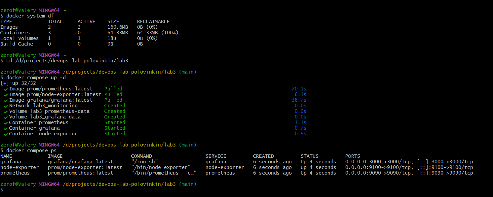
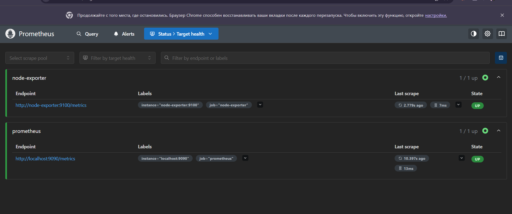
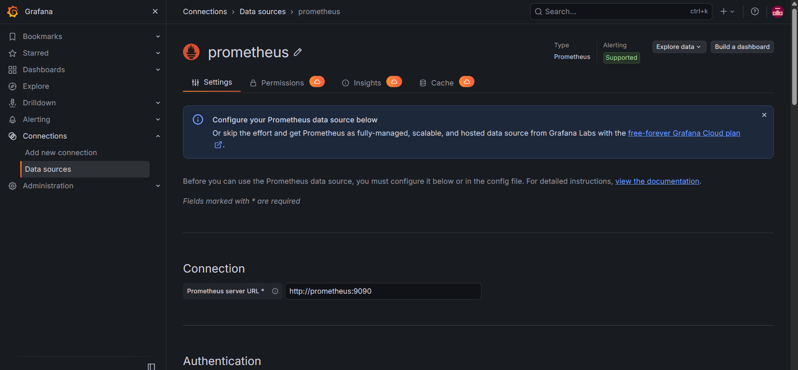
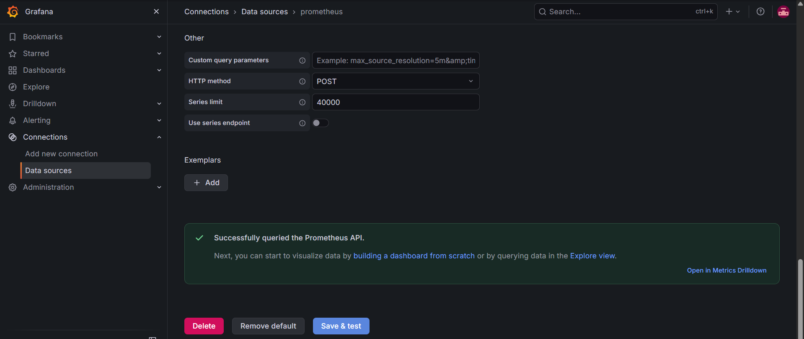
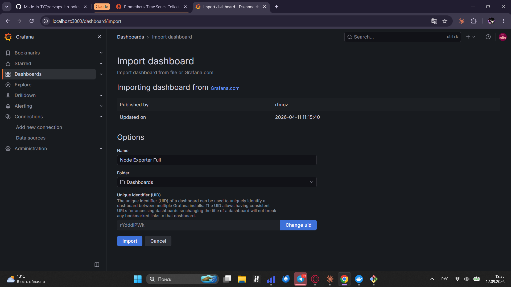
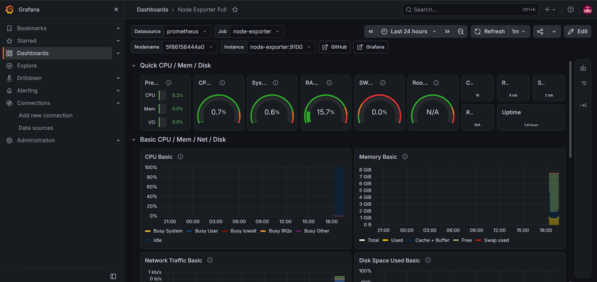

University: [ITMO University](https://itmo.ru/ru/)
Faculty: [FICT](https://fict.itmo.ru)
Course: [Введение в веб технологии]
Year: 2026/2027
Group: U4225
Author: Половинкин Валерий Валерьевич
Lab: Lab3
Date of create: 12.09.2026
Date of finished: 12.09.2026

---

# Лабораторная работа №3. Мониторинг приложений с Prometheus и Grafana

## Цель работы

Развернуть систему мониторинга на основе Prometheus и Grafana, настроить сбор
метрик хостовой системы с помощью Node Exporter и построить дашборд для
визуализации собранных метрик.

## 1. Структура файлов и конфигурация стека

Все сервисы описаны одним файлом `docker-compose.yml`, размещённым в каталоге
`lab3`. Такой способ выбран вместо последовательного запуска трёх команд
`docker run`, поскольку сервисы должны работать в общей сети и обращаться друг
к другу по имени, а также сохранять данные между перезапусками.

Содержимое `docker-compose.yml`:

```yaml
services:
  prometheus:
    image: prom/prometheus:latest
    container_name: prometheus
    ports:
      - "9090:9090"
    volumes:
      - ./prometheus.yml:/etc/prometheus/prometheus.yml
      - prometheus-data:/prometheus
    networks:
      - monitoring

  node-exporter:
    image: prom/node-exporter:latest
    container_name: node-exporter
    ports:
      - "9100:9100"
    networks:
      - monitoring

  grafana:
    image: grafana/grafana:latest
    container_name: grafana
    ports:
      - "3000:3000"
    volumes:
      - grafana-data:/var/lib/grafana
    networks:
      - monitoring

volumes:
  prometheus-data:
  grafana-data:

networks:
  monitoring:
```

Назначение ключевых элементов:

- `services` — три независимых сервиса: `prometheus` собирает и хранит метрики,
  `node-exporter` отдаёт метрики операционной системы, `grafana` отвечает за
  визуализацию;
- `ports` — проброс портов на хостовую машину: 9090 для веб-интерфейса
  Prometheus, 9100 для страницы метрик Node Exporter, 3000 для Grafana;
- `volumes` на уровне сервисов — подключение файла конфигурации Prometheus
  внутрь контейнера и именованных томов для хранения данных;
- `volumes` на верхнем уровне — объявление именованных томов
  `prometheus-data` и `grafana-data`. Благодаря им база метрик и настройки
  Grafana не теряются при пересоздании контейнеров;
- `networks` — общая пользовательская сеть `monitoring`. Внутри неё Docker
  предоставляет встроенный DNS, поэтому контейнеры обращаются друг к другу по
  имени сервиса, а не по IP-адресу, который меняется при каждом запуске.

Содержимое `prometheus.yml`:

```yaml
global:
  scrape_interval: 15s

scrape_configs:
  - job_name: 'prometheus'
    static_configs:
      - targets: ['localhost:9090']

  - job_name: 'node-exporter'
    static_configs:
      - targets: ['node-exporter:9100']
```

Параметр `scrape_interval: 15s` задаёт периодичность опроса целей — Prometheus
обращается к каждой из них раз в 15 секунд и сохраняет полученные значения с
меткой времени. Блок `scrape_configs` перечисляет цели опроса, объединённые в
задания (`job`).

Первое задание `prometheus` собирает метрики самого сервера Prometheus, поэтому
в качестве цели указан `localhost:9090` — с точки зрения контейнера Prometheus
это он сам. Второе задание `node-exporter` использует адрес
`node-exporter:9100`, где `node-exporter` — имя сервиса из `docker-compose.yml`.
Прямой адрес `localhost:9100` здесь не подошёл бы: внутри контейнера Prometheus
`localhost` указывает на сам этот контейнер, а не на хостовую машину.

## 2. Запуск стека мониторинга

Стек запущен из каталога `lab3` командой:

```bash
cd /d/projects/devops-lab-polovinkin/lab3
docker compose up -d
docker compose ps
```

Флаг `-d` запускает сервисы в фоновом режиме и сразу освобождает терминал.
Отсутствующие локально образы `prom/prometheus:latest`,
`prom/node-exporter:latest` и `grafana/grafana:latest` были автоматически
загружены из Docker Hub (строки `Pulled`), после чего Docker Compose создал
сеть `lab3_monitoring`, тома `lab3_prometheus-data` и `lab3_grafana-data` и
запустил три контейнера. Префикс `lab3` в именах сети и томов добавляется
автоматически: за имя проекта Docker Compose принимает имя каталога, в котором
лежит файл конфигурации.

Команда `docker compose ps` подтвердила, что все три контейнера находятся в
статусе `Up`, а в столбце `PORTS` отображены пробросы `0.0.0.0:3000->3000/tcp`,
`0.0.0.0:9100->9100/tcp` и `0.0.0.0:9090->9090/tcp`.



**Рисунок 1 — Загрузка образов, создание сети и томов, запуск трёх контейнеров**

## 3. Проверка сбора метрик в Prometheus

В браузере открыт веб-интерфейс Prometheus по адресу `http://localhost:9090` и
проверена страница `Status → Target health`.

Оба задания находятся в состоянии `1 / 1 up`, обе цели имеют статус `UP`:

- задание `node-exporter` — точка сбора `http://node-exporter:9100/metrics` с
  метками `instance="node-exporter:9100"` и `job="node-exporter"`;
- задание `prometheus` — точка сбора `http://localhost:9090/metrics` с метками
  `instance="localhost:9090"` и `job="prometheus"`.

Столбец `Last scrape` показывает время, прошедшее с последнего успешного опроса,
и его длительность (7 мс и 13 мс соответственно). Значения подтверждают, что
опрос выполняется регулярно с заданным интервалом.



**Рисунок 2 — Страница Target health: обе цели в состоянии UP**

## 4. Подключение Prometheus как источника данных в Grafana

Grafana открыта по адресу `http://localhost:3000`. Первый вход выполнен с
учётными данными по умолчанию `admin` / `admin`, после чего пароль был изменён,
как того требует сама Grafana при первом запуске.

В разделе `Connections → Data sources` добавлен источник данных типа Prometheus.
В поле `Prometheus server URL` указан адрес `http://prometheus:9090`.

Здесь важна та же особенность сетевого взаимодействия, что и в конфигурации
Prometheus: этот адрес Grafana открывает не из браузера, а изнутри своего
контейнера. Поэтому использовать `http://localhost:9090` нельзя — `localhost`
внутри контейнера Grafana означает сам контейнер Grafana. Корректным адресом
является имя сервиса `prometheus`, которое разрешается встроенным DNS Docker
внутри сети `monitoring`. Обратное также верно: имя `prometheus` существует
только внутри этой сети, и попытка открыть `http://prometheus:9090`
непосредственно в браузере хостовой машины завершается ошибкой разрешения
имени.



**Рисунок 3 — Настройка источника данных: адрес `http://prometheus:9090`**

Кнопка `Save & test` вернула сообщение `Successfully queried the Prometheus
API`, что подтверждает доступность Prometheus из контейнера Grafana и
корректность настройки.



**Рисунок 4 — Успешная проверка подключения к Prometheus**

## 5. Импорт дашборда и визуализация метрик

Вместо построения панелей вручную использован готовый дашборд из каталога
grafana.com. В разделе `Dashboards → Import` введён идентификатор `1860`,
после нажатия кнопки `Load` Grafana загрузила описание дашборда
`Node Exporter Full` (автор `rfmoz`, дата обновления 11.04.2026) и предложила
подтвердить импорт.



**Рисунок 5 — Импорт дашборда Node Exporter Full по идентификатору 1860**

После импорта дашборд отобразил метрики, собранные Prometheus с Node Exporter.
В верхней части расположены сводные показатели: загрузка процессора 0.7 %,
системная нагрузка 0.6 %, использование оперативной памяти 15.7 %,
использование swap 0 %, время непрерывной работы 1.4 часа. Ниже выведены
графики `CPU Basic`, `Memory Basic`, `Network Traffic Basic` и
`Disk Space Used Basic` за выбранный интервал времени.

В качестве источника данных дашборд автоматически использовал настроенный
`prometheus`, а переменные `Job` и `Instance` приняли значения `node-exporter` и
`node-exporter:9100` — те же, что были заданы в `prometheus.yml`.



**Рисунок 6 — Дашборд Node Exporter Full с метриками системы**

Отдельно следует отметить, какие именно показатели собираются. Значение
`Nodename` на дашборде — `5f86156444a0`, то есть идентификатор контейнера, а
объём оперативной памяти составляет 8 ГиБ при 16 доступных ядрах. Docker Desktop
для Windows выполняет контейнеры внутри виртуальной машины WSL 2, поэтому
Node Exporter отдаёт метрики этой виртуальной машины, а не операционной системы
Windows напрямую. Для учебной задачи это не имеет значения, но при реальном
мониторинге сервера Node Exporter устанавливают непосредственно на хост либо
запускают с доступом к его пространствам имён.

## Выводы

В ходе лабораторной работы развёрнута полноценная система мониторинга из трёх
компонентов: Node Exporter как источник метрик операционной системы, Prometheus
как система сбора и хранения временных рядов и Grafana как средство
визуализации.

Освоена работа с Docker Compose: описание нескольких сервисов одним файлом,
объявление общей сети и именованных томов, запуск и проверка состояния группы
контейнеров одной командой. По сравнению с последовательным запуском команд
`docker run` этот способ заметно удобнее и, что важнее, воспроизводим —
конфигурация хранится в репозитории и разворачивается на другой машине без
изменений.

Ключевой практический вывод касается сетевого взаимодействия между
контейнерами. Внутри пользовательской сети Docker контейнеры адресуются по
именам сервисов, которые разрешаются встроенным DNS. Адрес `localhost` внутри
контейнера всегда указывает на сам контейнер, поэтому в конфигурации Prometheus
целью указан `node-exporter:9100`, а в настройках источника данных Grafana —
`http://prometheus:9090`. Эти же имена недоступны за пределами сети Docker: из
браузера хостовой машины сервисы открываются только по проброшенным портам
`localhost:9090`, `localhost:9100` и `localhost:3000`.

Разделение ролей между компонентами показывает общий принцип построения систем
мониторинга: экспортёр не хранит данные, а лишь отдаёт текущие значения по
запросу; система сбора периодически опрашивает экспортёры и накапливает историю;
средство визуализации не обращается к экспортёрам напрямую, а строит графики по
данным из системы сбора. Благодаря такому разделению добавление нового
наблюдаемого объекта сводится к запуску ещё одного экспортёра и добавлению цели
в `scrape_configs`, без изменения остальных компонентов.
