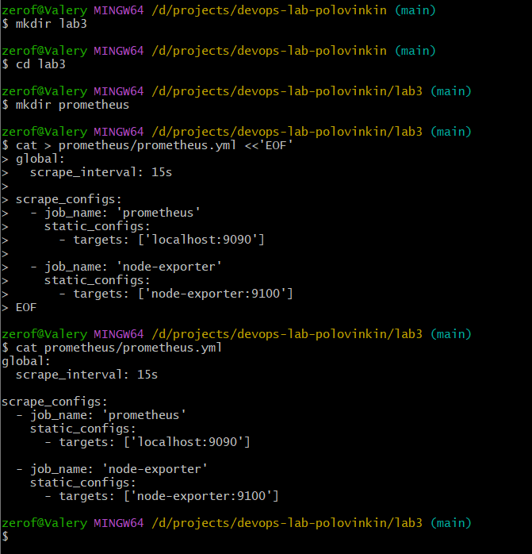
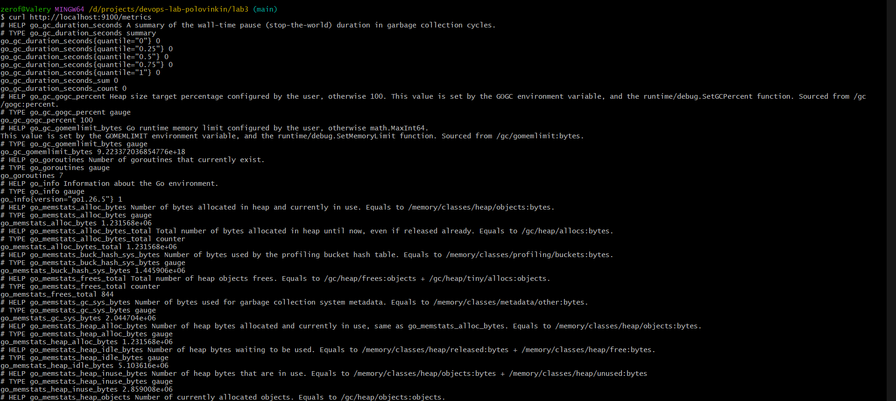
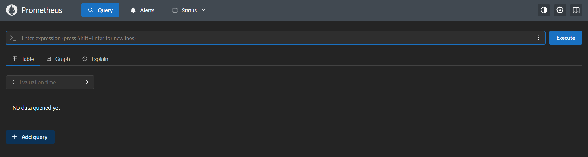
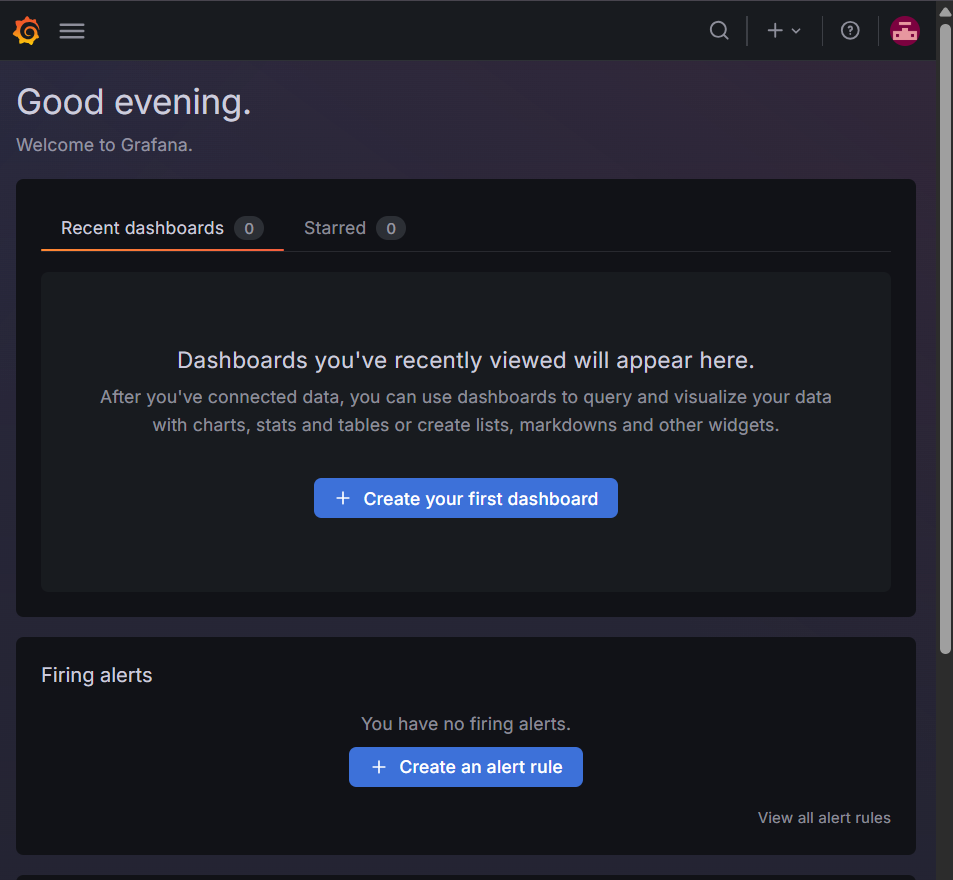
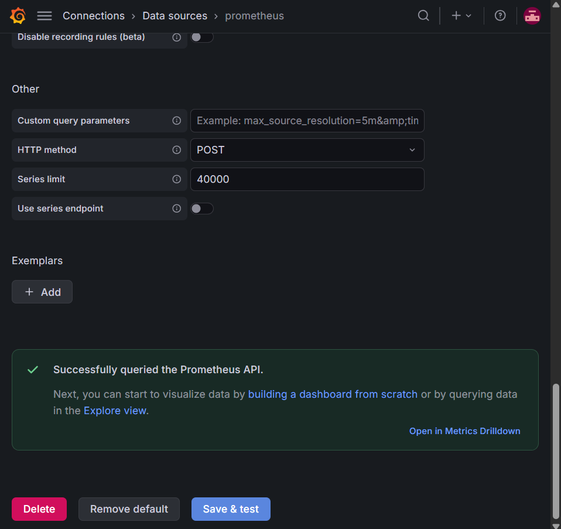
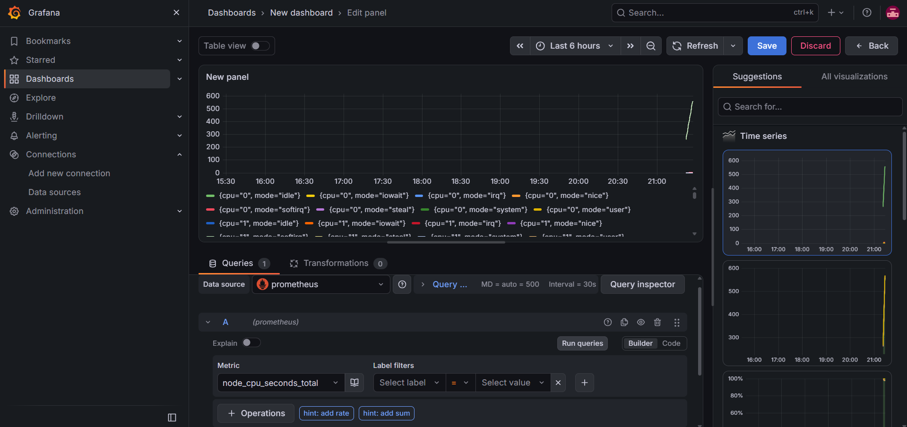
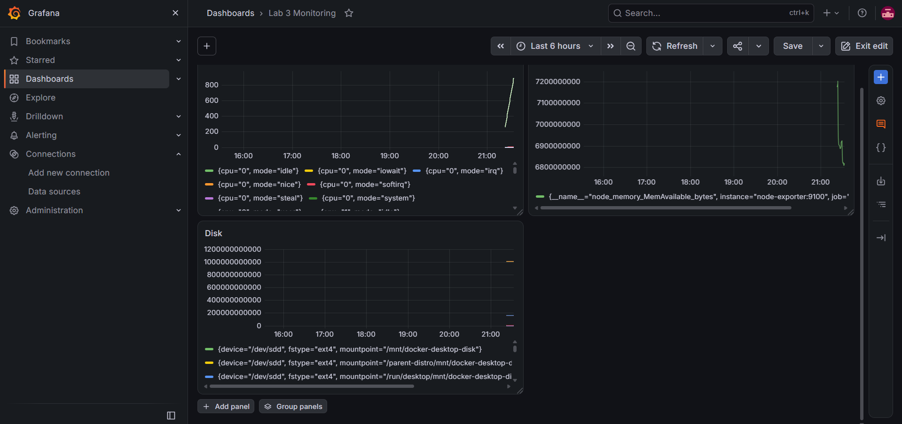
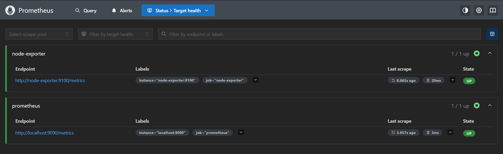
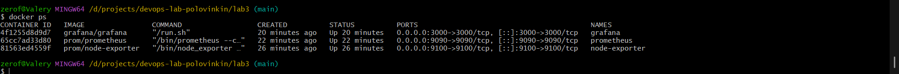

# Лабораторная работа №3

## Мониторинг с Prometheus и Grafana

University: [ITMO University](https://itmo.ru/ru/)  
Faculty: [FICT](https://fict.itmo.ru)  
Course: [Введение в веб технологии](https://itmo-ict-faculty.github.io/introduction-in-web-tech/)  
Year: 2026/2027  
Group: U4225  
Author: Половинкин Валерий Валерьевич  
Lab: Lab3  
Date of create: 12.09.2026  
Date of finished:

## Цель работы

Настроить локальную систему мониторинга с использованием Prometheus и Grafana, организовать сбор системных метрик через Node Exporter и создать дашборд для визуализации показателей CPU, памяти и диска.

## 1. Создание конфигурации Prometheus

В каталоге `lab3` была создана папка `prometheus`, а в ней файл `prometheus/prometheus.yml`.

Конфигурация:

```yaml
global:
  scrape_interval: 15s

scrape_configs:
  - job_name: 'prometheus'
    static_configs:
      - targets: ['localhost:9090']

  - job_name: 'node-exporter'
    static_configs:
      - targets: ['node-exporter:9100']
```

Prometheus настроен на сбор собственных метрик с порта `9090` и системных метрик Node Exporter с порта `9100`.



**Рисунок 1 — Создание и проверка файла `prometheus/prometheus.yml`**

## 2. Запуск Node Exporter

Node Exporter был запущен в Docker-контейнере. Поскольку работа выполнялась в Git Bash на Windows, перед командой использовалась переменная `MSYS_NO_PATHCONV=1`, чтобы Git Bash не преобразовывал Linux-пути монтирования.

```bash
MSYS_NO_PATHCONV=1 docker run -d \
  --name node-exporter \
  --restart=unless-stopped \
  -p 9100:9100 \
  -v "/proc:/host/proc:ro" \
  -v "/sys:/host/sys:ro" \
  -v "/:/rootfs:ro" \
  prom/node-exporter \
  --path.procfs=/host/proc \
  --path.rootfs=/rootfs \
  --path.sysfs=/host/sys \
  --collector.filesystem.mount-points-exclude="^/(sys|proc|dev|host|etc)($$|/)"
```

Работа Node Exporter была проверена командой:

```bash
curl http://localhost:9100/metrics
```

В ответ были получены метрики в формате Prometheus.



**Рисунок 2 — Проверка работы Node Exporter через endpoint `/metrics`**

## 3. Запуск Prometheus

Для хранения данных Prometheus был создан Docker volume:

```bash
docker volume create prometheus-data
```

Также была создана общая Docker-сеть:

```bash
docker network create monitoring
```

Так как Node Exporter был запущен до создания сети `monitoring`, он был дополнительно подключен к ней:

```bash
docker network connect monitoring node-exporter
```

Prometheus был запущен в контейнере с подключением созданного тома, конфигурационного каталога и сети `monitoring`.

```bash
MSYS_NO_PATHCONV=1 docker run -d \
  --name prometheus \
  --network monitoring \
  --restart=unless-stopped \
  -p 9090:9090 \
  -v prometheus-data:/prometheus \
  -v "$(pwd -W)/prometheus:/etc/prometheus" \
  prom/prometheus \
  --config.file=/etc/prometheus/prometheus.yml \
  --storage.tsdb.path=/prometheus \
  --web.console.libraries=/etc/prometheus/console_libraries \
  --web.console.templates=/etc/prometheus/consoles \
  --storage.tsdb.retention.time=200h \
  --web.enable-lifecycle
```

После запуска веб-интерфейс Prometheus стал доступен по адресу `http://localhost:9090`.



**Рисунок 3 — Запущенный веб-интерфейс Prometheus**

## 4. Запуск Grafana

Для Grafana был создан отдельный Docker volume:

```bash
docker volume create grafana-data
```

Grafana была запущена в общей сети `monitoring`:

```bash
docker run -d \
  --name grafana \
  --network monitoring \
  --restart=unless-stopped \
  -p 3000:3000 \
  -v grafana-data:/var/lib/grafana \
  -e "GF_SECURITY_ADMIN_PASSWORD=admin" \
  grafana/grafana
```

После запуска Grafana стала доступна по адресу `http://localhost:3000`. Вход выполнен с учетными данными `admin/admin`.



**Рисунок 4 — Главная страница Grafana после входа**

## 5. Подключение Prometheus к Grafana

В Grafana был добавлен источник данных Prometheus. В качестве адреса сервера указан:

```text
http://prometheus:9090
```

Проверка соединения через `Save & test` завершилась успешно: Grafana смогла обратиться к Prometheus API.



**Рисунок 5 — Успешная проверка источника данных Prometheus**

## 6. Создание дашборда

Был создан дашборд `Lab 3 Monitoring`.

Для первой панели использована требуемая в задании метрика:

```text
node_cpu_seconds_total
```

Grafana успешно получила данные и построила временной график.



**Рисунок 6 — Визуализация метрики `node_cpu_seconds_total`**

Дополнительно были созданы панели для памяти и диска:

```text
node_memory_MemAvailable_bytes
node_filesystem_avail_bytes
```

Итоговый дашборд содержит три панели: график загрузки процессора по метрике
`node_cpu_seconds_total`, график доступной оперативной памяти по метрике
`node_memory_MemAvailable_bytes` и панель `Disk` с метрикой
`node_filesystem_avail_bytes`.



**Рисунок 7 — Итоговый дашборд Grafana с графиками CPU, памяти и диска**

## 7. Тестирование системы

В Prometheus в разделе `Status → Target health` были проверены источники метрик. Оба target находятся в состоянии `UP`:

- `node-exporter:9100`;
- `localhost:9090` (Prometheus).



**Рисунок 8 — Prometheus успешно собирает метрики с обоих источников**

Финальная проверка контейнеров выполнена командой:

```bash
docker ps
```

Одновременно работают три контейнера:

- `grafana` — порт `3000`;
- `prometheus` — порт `9090`;
- `node-exporter` — порт `9100`.



**Рисунок 9 — Финальная проверка работающих Docker-контейнеров**

## Вывод

В ходе лабораторной работы была настроена локальная система мониторинга на основе Prometheus и Grafana. Node Exporter собирает системные метрики, Prometheus получает и хранит их, а Grafana использует Prometheus как источник данных и визуализирует показатели CPU, доступной памяти и файловой системы. Проверка `Target health` показала состояние `UP` для Prometheus и Node Exporter, а команда `docker ps` подтвердила одновременную работу всех трех контейнеров.
